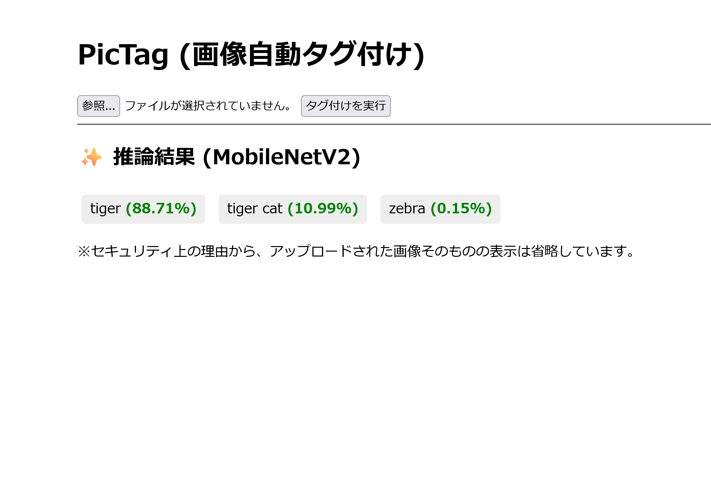

# PicTag: ローカルML駆動 画像自動タグ付けアプリ
画像をアップロードすると、事前学習済み MobileNetV2 モデルが推論し、上位3つのタグと確率を瞬時に表示する Web デモアプリケーション。

## 1. プロジェクト概要 (Project Overview)

### プロジェクトの目的
目的: Web 開発、機械学習のスキルを習得するために、Flask を用いた Web 構築と、PyTorch (MobileNetV2) のローカル統合を目的とした週末プロジェクト。

### 技術スタック (Tech Stack)
分野|技術|役割・採用理由
-|-|-
バックエンド/Web|Python、Flask|軽量でシンプルな Python Web フレームワーク。週末でAPIとWebサーバーを統合するのに最適。
機械学習 (ML)|Pytorch、torchvision|ML モデル（MobileNetV2）のロード、前処理、推論に使用。ローカル統合の経験を示す。
モデル|MobileNetV2|高速で軽量な画像分類モデルを採用。ローカル推論の速度と効率性を確保。
補助|PIL (Pillow)、werkzeug|画像ファイルの読み書きや、ファイル名を安全に処理するために使用。

### 機能とデモ (Features & Demo)
1. ルート `/` にアクセスし、ファイル選択フォームから画像をアップロードします。
1. サーバーが画像を受け取り、一時的なフォルダに保存します。
1. MobileNetV2 モデルが画像を分析し、上位のタグと確率を計算します。
1. 結果が Web ページに表示され、一時ファイルは自動で削除されます。



## 2. セットアップと実行方法 (Setup & Usage)
1. リポジトリのクローン
    ```pwsh
    $ git clone [リポジトリURL]
    $ cd [プロジェクトフォルダ名]
    ```
1. 環境構築
    ```pwsh
    $ python -m venv .venv
    $ .\.venv\Scripts\Activate.ps1 # PowerShell
    $ pip install -e .
    ```
1. 実行
    ```pwsh
    $ flask --app pictag run
    ```

### Dockerを使う場合
1. リポジトリをクローンして、プロジェクトディレクトリに移動
1. Dockerコンテナを作成
    ```pwsh
    $ docker build -t pictag:latest .
    ```
1. Dockerコンテナを起動
    ```pwsh
    $ docker run -d -p 5000:5000 pictag:latest
    ```

## 3. 学びと課題 (Key Takeaways & Challenges)
- 学んだこと:
    - Web 開発の知識が少ない状態から、サーバーレスポンス、ルーティング、テンプレート処理（Jinja2）といった Web の基本構成を習得しました。
    - 機械学習モデルを外部 API ではなくローカル環境に組み込むという、MLOps の初期段階を実践しました。
- 挑戦と解決策
    - Q1: MobileNetV2が要求する画像形式（224x224, 正規化）への正確な変換。
        - A: torchvision.transforms を活用して、前処理パイプラインを定義しました。
    - Q2: アップロードされた画像ファイルの一時保存と、処理後の確実な削除。
        - A: try...finally ブロックを利用し、推論成功・失敗に関わらずファイルを削除するロジックを実装しました。
